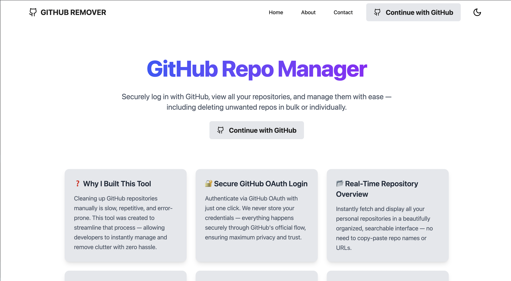
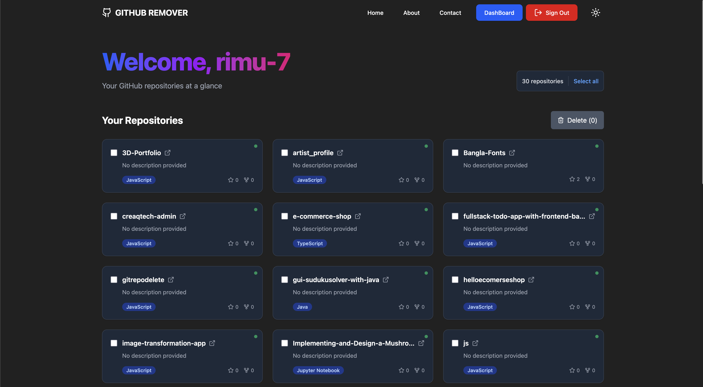

# GitHub Repository Manager

A modern web application for managing your GitHub repositories with enhanced UI/UX and additional functionality.

 *(Replace with actual screenshot path)*
 *(Replace with actual screenshot path)*

## Features

- 🔒 GitHub OAuth authentication
- 🖥️ Dashboard with repository overview
- 🗂️ Browse all your GitHub repositories
- ⭐ View repository details (stars, forks, language)
- 🗑️ Delete repositories directly from the app
- ✨ Modern, responsive UI with dark/light mode
- 🚀 Fast and intuitive interface

## Tech Stack

### Frontend
- React.js
- Vite
- Tailwind CSS
- Framer Motion (animations)
- React Icons (Lucide)
- Axios (HTTP client)
- React Router (navigation)
- React Toastify (notifications)

### Backend
- Node.js
- Express
- Passport.js (authentication)
- GitHub OAuth
- Express Session
- Helmet (security)
- Rate limiting

## Prerequisites

- Node.js (v16 or higher)
- npm or yarn
- GitHub OAuth App credentials

## Setup Instructions

### 1. Clone the repository

```bash
git clone https://github.com/your-username/github-repo-manager.git
cd github-repo-manager
```

### 2. Set up environment variables

Create a `.env` file in the root directory with the following variables:

```env
# Frontend (in root directory)
VITE_API_URL=http://localhost:4500

# Backend (in backend directory)
GITHUB_CLIENT_ID=your_github_client_id
GITHUB_CLIENT_SECRET=your_github_client_secret
SESSION_SECRET=your_session_secret
```

### 3. Install dependencies

```bash
# Install frontend dependencies
npm install

# Install backend dependencies
cd backend
npm install
cd ..
```

### 4. Run the application

In separate terminal windows:

```bash
# Start frontend
npm run dev

# Start backend (from project root)
cd server
node server.js
```

The application should now be running:
- Frontend: http://localhost:5173
- Backend: http://localhost:4500

## GitHub OAuth Setup

1. Go to GitHub Settings > Developer settings > OAuth Apps
2. Click "New OAuth App"
3. Set:
   - Application name: Your App Name
   - Homepage URL: http://localhost:5173
   - Authorization callback URL: http://localhost:4500/auth/github/callback
4. Register application and copy Client ID/Secret to your `.env` file

## Project Structure

```
github-repo-manager/
├── client/                  # Frontend source code
│   ├── src/
│   │   ├── components/      # React components
│   │   ├── pages/           # Page components
│   │   ├── App.jsx          # Main app component
│   │   └── main.jsx         # Entry point
│   ├── public/              # Static assets
│   └── vite.config.js       # Vite configuration
├── server/                  # Backend source code
│   ├── server.js            # Express server
│   └── package.json         # Backend dependencies           
└── README.md                # This file
```

## Available Scripts

In the project root directory:

- `npm run dev` - Start frontend development server
- `npm run build` - Build frontend for production

In the server directory:

- `node server.js` - Start backend server

## Contributing

Contributions are welcome! Please open an issue or submit a pull request.

## License

[MIT](LICENSE)